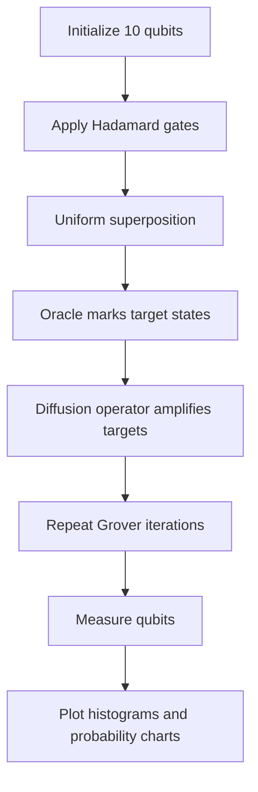

# Grover’s Algorithm — 10-Qubit Quantum Search (Qiskit + Colab)


This repository contains a **Google Colab–ready implementation of Grover’s Algorithm** using **Qiskit**.  
The notebook demonstrates the full quantum search workflow with clear visualizations:

- **Superposition circuit**
- **Oracle circuit**
- **Diffusion operator**
- **Amplitude evolution plots**
- **Probability vs. iteration chart**
- **Measurement histograms** for multiple iteration counts

The code is built around a **10-qubit search space**, which means the algorithm searches among **2¹⁰ = 1024 states** and marks two target bit strings:

- `0110011010`
- `1101010001`

---

## Table of Contents

- [Project Overview](#project-overview)
- [How Grover’s Algorithm Works](#how-grovers-algorithm-works)
- [Notebook Workflow](#notebook-workflow)
- [Visual Outputs](#visual-outputs)
- [Repository Structure](#repository-structure)
- [Installation](#installation)
- [How to Run](#how-to-run)
- [Key Parameters](#key-parameters)
- [Expected Results](#expected-results)
- [Customization](#customization)
- [Troubleshooting](#troubleshooting)
- [References](#references)

---

## Project Overview

Grover’s Algorithm is a quantum search algorithm that gives a **quadratic speedup** over classical brute-force search.

In this notebook, the search process is implemented step by step:

1. Create a uniform superposition across all 1024 basis states.
2. Apply an **oracle** to mark the target state(s).
3. Apply the **diffusion operator** to amplify the target amplitudes.
4. Repeat the Grover iteration the optimal number of times.
5. Measure the circuit and compare the results using histograms.

The notebook also computes the **optimal Grover iteration count** using:

\[
k \approx \frac{\pi}{4}\sqrt{\frac{N}{M}}
\]

where:

- \(N\) = total number of states
- \(M\) = number of marked states

For this project:

- \(N = 1024\)
- \(M = 2\)
- optimal iteration count is calculated automatically in the notebook

---

## How Grover’s Algorithm Works

Grover’s Algorithm repeatedly applies two main quantum operators:

### 1. Superposition
All qubits are placed into an equal-weight superposition using Hadamard gates.

### 2. Oracle
The oracle identifies the target state(s) and flips their phase.  
In this notebook, the oracle is built using a **multi-controlled X (MCX)** pattern with X gates around the zero-valued control bits.

### 3. Diffusion Operator
The diffusion operator performs **inversion about the mean**.  
It increases the probability of the marked states while reducing the others.

### 4. Repetition
By repeating oracle + diffusion, the probability amplitude of the target state(s) grows until the optimal iteration count is reached.

### 5. Measurement
Finally, the circuit is measured and the resulting bit-string frequencies are plotted.

---

## Notebook Workflow




---

## Visual Outputs

The notebook saves a full set of figures that can be committed to GitHub and referenced directly in this README.

> Put the generated PNG files in an `images/` folder for the links below to work cleanly on GitHub.

### 1) Superposition Circuit


This circuit applies `H` to all 10 qubits and creates the starting uniform state.

### 2) Superposition Distribution


This chart shows that every basis state starts with the same probability.

### 3) Oracle Circuit


The oracle flips the phase of the marked bit strings:
- `0110011010`
- `1101010001`

### 4) Oracle Amplitude Visualization


This figure compares amplitudes before and after the oracle.  
The marked states become negative while the others remain unchanged.

### 5) Diffusion Circuit


This circuit implements the diffusion operator:

\[
D = H^{\otimes n} X^{\otimes n} H \, MCX \, H X^{\otimes n} H^{\otimes n}
\]

It is the core amplitude-amplification step in Grover’s Algorithm.

### 6) Amplitude Flow Across One Grover Step


This plot shows the state after:
- superposition
- oracle
- diffusion

It makes the amplitude amplification process easy to understand visually.

### 7) Probability vs Iteration Chart


This graph shows how the probability of measuring a marked state changes as Grover iterations increase.  
The notebook highlights:
- iteration 1
- iteration 3
- iteration 5
- the calculated optimal iteration count

### 8) Full Grover Circuit for One Iteration


This is the full end-to-end circuit showing:
- superposition
- oracle
- diffusion
- measurement

### 9) Measurement Histograms


These histograms compare the measurement results for different iteration counts.

### 10) Combined Histogram Comparison


This figure compares all tested iteration counts side by side and makes it easy to see which iteration count gives the best concentration on the marked states.

---

## Repository Structure

```text
project/
├── README.md
├── Welcome_to_Colab_(16).ipynb
└── images/
    ├── task1_superposition_circuit.png
    ├── task1_superposition_distribution.png
    ├── task2_oracle_circuit.png
    ├── task2_oracle_amplitudes.png
    ├── task3_diffusion_circuit.png
    ├── task3_diffusion_amplitudes.png
    ├── task4_iteration_probability.png
    ├── task4_grover_circuit_1iter.png
    ├── task5_histogram_iters_01.png
    ├── task5_histogram_iters_03.png
    ├── task5_histogram_iters_05.png
    ├── task5_histogram_iters_18.png
    └── task5_combined_histograms.png
```

---

## Installation

Run the following inside Google Colab:

```bash
pip install qiskit qiskit-aer matplotlib pylatexenc -q
```

If you want to run it locally, use:

```bash
pip install qiskit qiskit-aer matplotlib numpy pylatexenc
```

---

## How to Run

1. Open the notebook in Google Colab.
2. Run the cells in order.
3. Wait for the dependency installation to finish.
4. Let the notebook generate the circuit images and plots.
5. Review the output figures and histogram comparisons.

The notebook is structured into five tasks:

- **Task 1:** Superposition
- **Task 2:** Oracle
- **Task 3:** Diffusion Operator
- **Task 4:** Grover Iterations and probability tracking
- **Task 5:** Execution and measurement histograms

---

## Key Parameters

You can edit these values near the top of the notebook:

| Parameter | Meaning | Current Value |
|---|---|---:|
| `N_QUBITS` | Number of qubits | 10 |
| `TARGETS` | Marked bit strings | `["0110011010", "1101010001"]` |
| `SHOTS` | Measurement shots | 4096 |
| `M` | Number of marked states | 2 |
| `N_STATES` | Total search states | 1024 |
| `OPT_ITERS` | Optimal Grover iterations | Auto-calculated |

---

## Expected Results

When the notebook is working correctly, you should see:

- A **uniform probability distribution** at the beginning
- Negative amplitudes for the target states after the oracle
- Stronger amplitude concentration on marked states after diffusion
- A probability curve that rises toward an optimum and then starts to fall if iterations continue too far
- Histograms where the marked states become the most frequent measurement results near the optimal iteration count

In other words, the notebook demonstrates the core Grover behavior:  
**target states become much more likely than the rest of the search space.**

---

## Customization

You can adapt the notebook for your own experiments by changing:

- `N_QUBITS` for a larger or smaller search space
- `TARGETS` for different marked bit strings
- `SHOTS` for smoother or faster histogram generation
- `max_track` for a wider iteration sweep
- the plotting style if you want darker or simpler visuals

If you increase the number of qubits, keep in mind that simulation becomes more expensive.

---

## Troubleshooting

### The notebook runs slowly
A 10-qubit simulation is still manageable, but increasing the qubit count will make statevector simulation heavier.

### Images are not showing in GitHub
Make sure the PNG files are committed in the `images/` folder and that the file names match exactly.

### Qiskit import errors
Re-run the installation cell:

```bash
pip install qiskit qiskit-aer matplotlib pylatexenc -q
```

### Histograms look noisy
Increase `SHOTS` to get smoother measurement statistics.

---

## References

- Qiskit Documentation
- Nielsen & Chuang, *Quantum Computation and Quantum Information*
- Standard Grover search formulation and amplitude amplification theory

---

## License

Add your preferred license here if you plan to publish the repository publicly.
